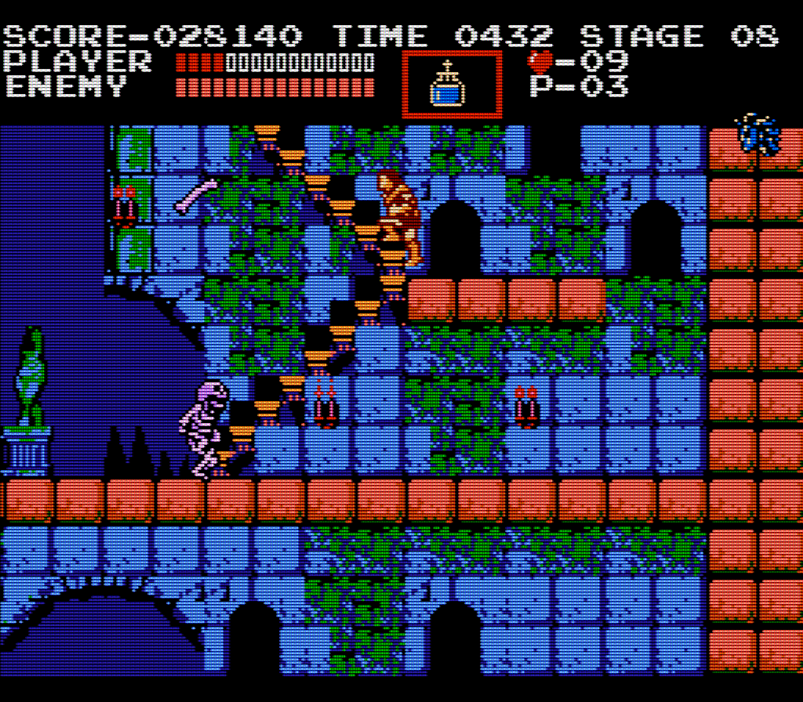

# scanlines
Convert an image as if it was displayed on a CRT display.
Usage:
```
  scanlines INFILE [OUTFILE]
```
If OUTFILE is missing, a suffix is appended to INFILE for the new file name.
The result is saved as a PNG file.


